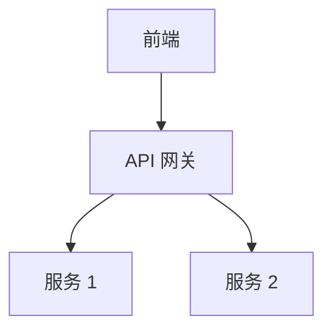

<!-- artifact_type: surface -->
<!-- PDLC-TRACE -->
<!-- 功能名称: 架构总览 -->
<!-- 阶段: design -->
<!-- 创建时间: <执行时的实际 ISO 8601 时间戳> -->

# 系统架构总览

> **surface 型产物**：描述系统"当前长什么样"，由 `/pdlc-arch` 就地覆盖更新。演进历史见 `git log docs/ARCHITECTURE.md`。不创建带日期/版本号的副本。

## 1. 系统全景

<!-- 文本描述 + 可选 mermaid 图。各组件 / 服务 / 模块及其职责边界 -->

## 2. 服务拆分

| 服务 | 职责 | 数据归属 | 对外接口 |
|------|------|----------|----------|
| | | | |

## 3. 通信机制

<!-- 同步 REST/gRPC / 异步消息队列；接口版本策略；容错 -->

## 4. 数据架构

<!-- 数据库拆分；一致性方案；缓存策略 -->

## 5. 可观测性

<!-- 日志规范；监控指标（RED）；链路追踪 -->

## 6. 可扩展性

<!-- 水平扩展；负载均衡；容量规划 -->

## 7. 架构评分

| 维度 | 评分 (1-5) | 依据 |
|------|-----------|------|
| 服务拆分合理性 | | |
| 通信机制 | | |
| 数据架构 | | |
| 可观测性 | | |
| 可扩展性 | | |

## 8. 问题清单与改进建议

| 优先级 | 问题 | 建议 |
|--------|------|------|
| P0 | | |

---

> per-feature 的架构决策（"为某个 feature 为什么改架构"）记录在 `docs/02_design/architecture/<功能ID>-*-arch.md`（ledger 型），与本总览分工互补。
